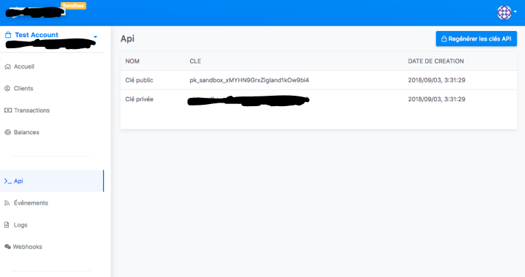

# FedaPay ShowCase

- Get API Key



- Setup a Laravel(PHP) Project with FedaPay

```
$ laravel composer create-project --prefer-dist laravel/laravel fedapay-showcase
$ composer require fedapay/fedapay-php
```

- Add secret key to .env and environment (sandbox or live)

```
FEDAPAY_SECRET_KEY=***	
FEDAPAY_ENVIRONMENT=sandbox
```

- Create a  config/fedapay.php file

```
<?php

return [
    'secret_key' => env('FEDAPAY_SECRET_KEY'),

    'environment' => env('FEDAPAY_ENVIRONMENT')
];
```

- Create a transaction

```
use FedaPay;

...


try {
    $transaction = FedaPay\Transaction::create(
        $this->fedapayTransactionData()
    );

    $token = $transaction->generateToken();

    return redirect()->away($token->url);
} catch(\Exception $e) {
    return back()->with('error', $e->getMessage());
}

...

private function fedapayTransactionData()
{
    $customer_data = [
        'firstname' => 'Junior',
        'lastname' => 'Gantin',
        'email' => 'nioperas06@gmail.com',
        'phone_number' => [
            'number'  => '66526416',
            'country' => 'bj'
        ]
    ];

    return [
        'description' => 'Buy e-book!',
        'amount' => 500,
        'currency' => ['iso' => 'XOF'],
        'callback_url' => url('callback'),
        'customer' => $customer_data
    ];
}
...

```

- Create a callback

```

public function callback(Request $request)
{
    ...
    
    $transaction_id = $request->input('id');
    $message = '';

    try {
        $transaction = FedaPay\Transaction::retrieve($transaction_id);
        switch($transaction->status) {
            case 'approved':
                $message = 'Transaction approuvée.';
            break;
            case 'canceled':
                $message = 'Transaction annulée.';
            break;
            case 'declined':
                $message = 'Transaction déclinée.';
            break;
        }

    } catch(\Exception $e) {
        $message = $e->getMessage();
    }

    ...

}

```